# SecureSync - Encrypted Messaging Platform

This is a [Next.js](https://nextjs.org) project bootstrapped with [`create-next-app`](https://nextjs.org/docs/app/api-reference/cli/create-next-app).

## Getting Started

First, run the development server:

```bash

pnpm dev

```

Open [http://localhost:3000](http://localhost:3000) with your browser to see the result.

## 🔒 Architectural Overview:

Core Architecture Diagram


## Technology Stack that im thinking to use :

```mermaid

flowchart LR
    Frontend["Frontend 🖥️<br>- Next.js 14<br>- TypeScript<br>- Tailwind CSS<br>- Zustand/Redux<br>- React Query"] --> Backend["Backend 🗄️<br>- Node.js/Express<br>- tRPC/GraphQL<br>- Prisma ORM<br>- WebSocket<br>- Redis"]
    Backend --> Database["Database 💾<br>- PostgreSQL<br>- MongoDB<br>- Redis Cache"]
    Backend --> Security["Security 🔐<br>- JWT Authentication<br>- End-to-End Encryption<br>- WebRTC<br>- OAuth"]
    Backend --> RealTime["Real-Time 📡<br>- Socket.io<br>- WebRTC<br>- Server-Sent Events"]
    Backend --> Deploy["DevOps 🚀<br>- Docker<br>- Kubernetes<br>- GitHub Actions<br>- AWS/Vercel"]
```



